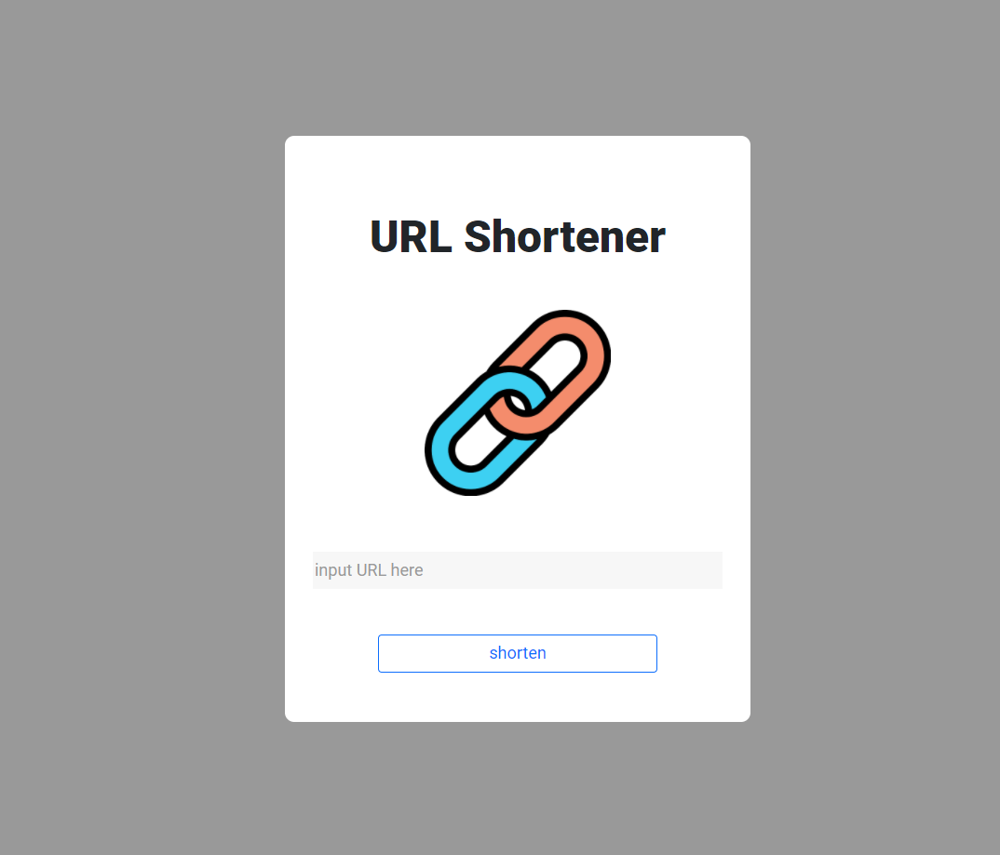

# URL Shortener 短網址產生器

## 簡介
將原網址轉成簡短的短網址
## 功能
- 輸入網址轉換成短網址
- 使用Copy複製短網址
## 安裝
1. 安裝 node.js 和 npm
2. 將此專案clone至本機
```
https://github.com/HitomiHuang/url-shortener
```
3. 透過終端機切換至專案資料夾
4. 執行安裝
```
npm install
```
5. 啟動伺服器
```
npm run dev
```
6. 出現以下訊息，代表伺服器已順利啟動
```
Express is running on http://localhost:3000
mongoose connected!
```
7. 若要關閉伺服器，請執行
```
Ctrl + C
```
## 開發工具
- Node.js 14.16.0
- Express 4.17.2
- Express-handlebars 6.0.2
- Mongoose 6.1.8
- Valid-url 1.0.9
